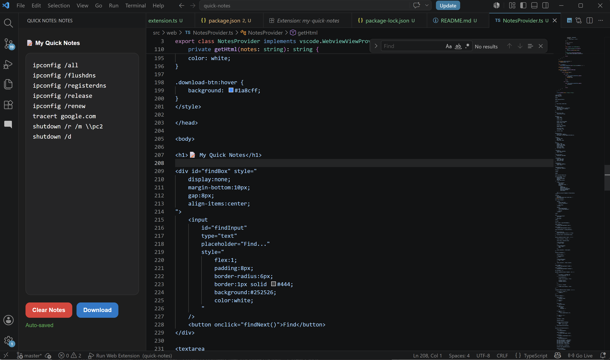
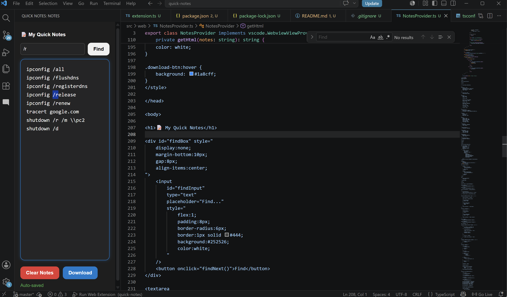

# My Quick Notes

A beautiful and lightweight quick notes sidebar for Visual Studio Code that helps you quickly capture ideas, reminders, code snippets, and to-do lists without leaving your workspace.

## Features

* ✨ Clean and intuitive user interface
* 💾 Auto-save notes as you type
* 🔄 Persistent storage across VS Code sessions
* ⚡ Fast access from the Activity Bar
* 🌐 Works completely offline
* 🔍 Keyword search to quickly find notes and important text
* 🗑️ Clear Notes button to instantly remove all note content
* 📥 Download Notes option to export and save your notes as a file
* 📌 Lightweight and distraction-free experience

## Usage

1. Open the **Quick Notes** icon from the VS Code Activity Bar.
2. Start typing your notes.
3. Notes are automatically saved in real time.
4. Use the **CTRL+F** feature to find keywords within your notes.
5. Click **Clear Notes** to remove all existing content.
6. Click **Download Notes** to export your notes and save them locally.

## Screenshots

### Main Sidebar

### Search Notes

## Release Notes

### 0.0.2

#### New Features

* Added keyword search functionality
* Added **Clear Notes** button
* Added **Download Notes** option for exporting notes
* Improved note management experience
* Enhanced UI responsiveness

### 0.0.2

Initial release.
